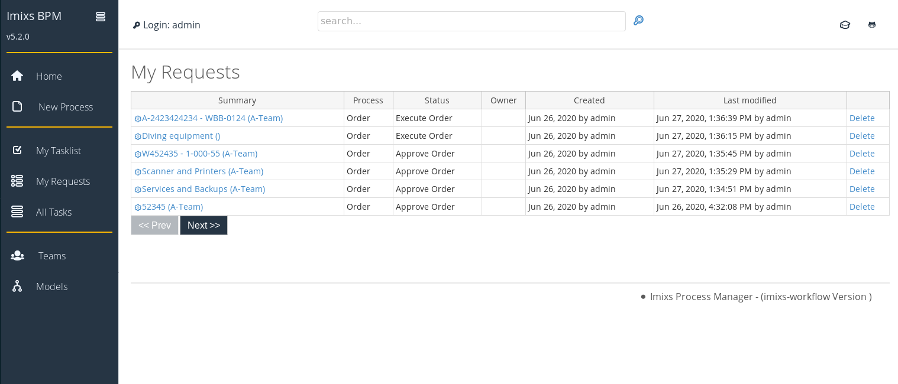
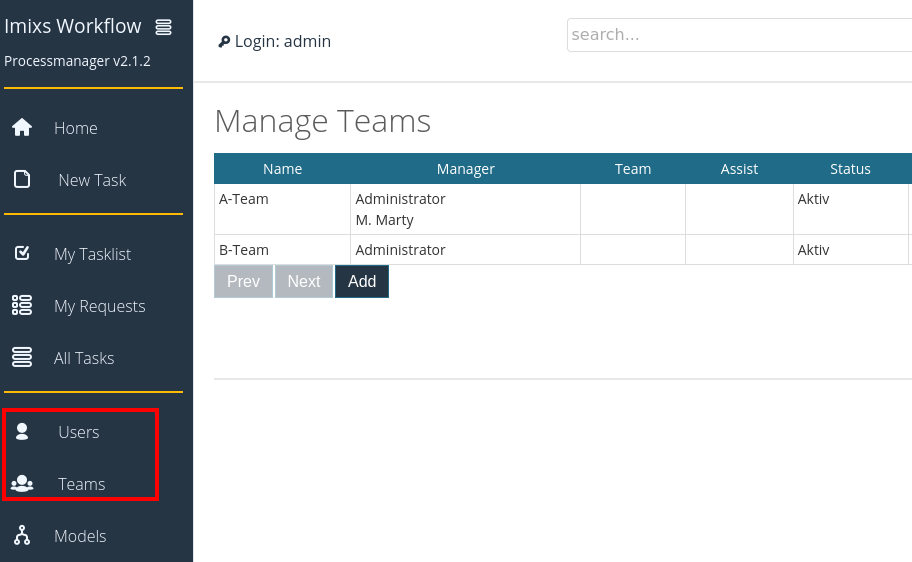

[](https://github.com/imixs/imixs-process-manager/actions/workflows/maven.yml)
[](https://github.com/imixs/imixs-workflow/discussions)

# The Imixs Process Manager

The digitization of business processes has become a key challenge for modern application design.
Essentially, you only need two things to do this.

- a process description - which you ideally create using the BPMN 2.0 standard
- a runtime environment - which allows you to execute and persist your process instances in a secure way

The Open Source project [Imixs-Workflow](http://www.imixs.org) provides you with an open and powerful workflow management platform that combines the design and the execution of business processes in a highly scalable and easy to use environment.

With the _Imixs Process Manager_ you can start quickly and develop and test your own business process. And of course you can customize and extend this platform and use it for development as well as for production.

## How to Install

The _Imixs Process Manager_ comes with a Docker profile which enables you to start within seconds. If you haven't already installed Docker, follow the instructions [here](https://docs.docker.com/get-docker/).

Download the [docker-compose.yml](https://raw.githubusercontent.com/imixs/imixs-process-manager/master/docker-compose.yml) file...

```yaml
version: "3.6"
services:
  imixs-db:
    image: postgres:13.11
    environment:
      POSTGRES_PASSWORD: adminadmin
      POSTGRES_DB: workflow-db
    volumes:
      - dbdata:/var/lib/postgresql/data

  imixs-app:
    image: imixs/imixs-process-manager:latest
    environment:
      TZ: "CET"
      LANG: "en_US.UTF-8"
      JAVA_OPTS: "-Dnashorn.args=--no-deprecation-warning"
      POSTGRES_USER: "postgres"
      POSTGRES_PASSWORD: "adminadmin"
      POSTGRES_CONNECTION: "jdbc:postgresql://imixs-db/workflow-db"
    ports:
      - "8080:8080"
      - "8787:8787"
      - "9990:9990"
volumes:
  dbdata:
```

... and run

    $ docker-compose up

After a few seconds the Imixs Process Manager is up and running. You can access it from your web browser at: [http://localhost:8080/](http://localhost:8080/)


You can upload your own process model and create customized forms. You can view and search running process instances.



## Authentication and Authorization

Imixs-Workflow is a human-centric workflow engine which means that each actor need to authenticate against the service to interact.

The _Imixs Process Manager_ provides a user and team management. The users are stored in a database and used for authentication.
If you first deploy the system the application will create a default user:

| User  | Role                   | Password   |
| ----- | ---------------------- | ---------- |
| admin | IMIXS-WORKFLOW-Manager | adminadmin |

You can add you own accounts and teams using the user/team management section.



You will find more information about the security concept in the [Imixs-Workflow Deployent guide](https://www.imixs.org/doc/deployment/index.html).

## Process Design

You can define your own business process models using the [Imixs-BPMN modeller tool](https://www.imixs.org/doc/modelling/index.html) and you can upload and execute your models directly within Imixs Process Manager. General information about how to model can be found [here](https://www.imixs.org/doc/modelling/howto.html).

The Imixs Process Manager allows you to define custom forms for your business process without programming. By defining an XML template, you can store forms directly in a BPMN 2.0 model.


Example:

```xml
	<?xml version="1.0"?>
	<imixs-form>
	  <imixs-form-section label="Order">
	    <item name="_orderid" type="text" label="Order ID:" />
	    <item name="_orderdate" type="date" label="Order Date:" />
	  </imixs-form-section>
	</imixs-form>
```

You can create and change your models at runtime without interrupting your workflow instance.

## Jakarta EE 10

**Note:** Imixs-Workflow and the Imixs-Process-Manager are based on [Jakarta EE 10](https://jakarta.ee/). The project is currently developed based on [Wildfly version 27.0.0.Final](https://wildfly.org).

## Build

To build the artifact from sources run:

    $ mvn clean install

To build the new Docker Image run:

    $ mvn clean install -Pdocker

To run Wildfly Server in debug mode (port 8787) you can build the Docker Image with:

    $ mvn clean install -Pdebug

### Run

To start the Imixs-Process Manger with docker-compose, run:

    $ docker-compose -f docker-compose-dev.yaml up

## Autodeploy & Hot Deploy

We use the [Manik Hot-Deploy Plugin](https://manik.imixs.org/) to auto deploy the application during development.
To update the deployment just run:

    $ mvn install

During development of Jakarta EE Faces you can run the autodeploy mode to update your Web Frontend autoamtically:

    $ mvn manik-hotdeploy:hotdeploy

In this mode the Manik-Plugin will detect updates of the Web Frontend and updates your running applicaton.

## Open Liberty

To run the application on the Open Liberty Application Server with Docker run:

    $ mvn clean install -Pdocker-openliberty
    $ docker-compose -f docker-compose-openliberty.yaml up

The application running on OpenLiberty is available from:

    http://localhost:9080/

You can find the configuration details in the server section [OpenLiberty](/docker/configuration/openliberty/README.md)
